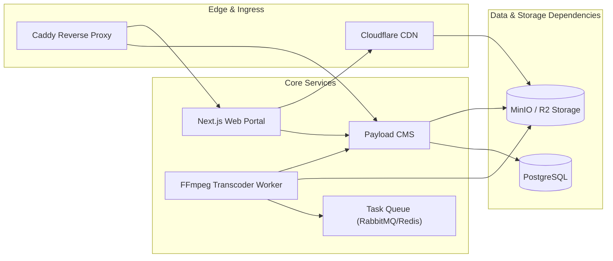

# System Dependency Map

### Dependency Invariants
1. **Payload CMS** depends directly on **PostgreSQL** for persistence and **MinIO** for raw upload storage.
2. **FFmpeg Worker** consumes jobs from **Task Queue**, reads raw video files from **MinIO**, writes HLS outputs to **MinIO**, and updates metadata in **Payload CMS**.
3. **Next.js Web Portal** depends on **Payload CMS APIs** for content rendering and **Cloudflare CDN / MinIO** for HLS stream delivery.
