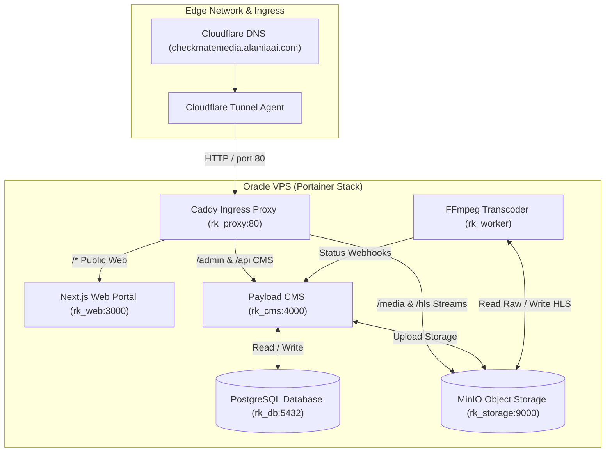

# System Architecture — Alamia OTT / RK Portal

## 1. Executive Intent & Deployment Architecture
**Alamia OTT / RK Portal** is a production-grade **hybrid News + Video (OTT) platform** inspired by modern digital media houses such as the BBC, Al Jazeera, DW, and TRT World.

### Production & Staging Infrastructure Model
* **Hosting Platform**: Oracle VPS running Docker + Portainer.
* **Ingress & Domain Gateway**: Cloudflare Tunnel routing `checkmatemedia.alamiaai.com` to internal container proxy (`http://rk_proxy:80`).
* **Deployment Workflow**: Single-click Portainer Stack deployment directly pulling from GitHub (`docker-compose.yml`).

---

## 2. High-Level System Architecture Diagram

---

## 3. Container Topology & Reverse Proxy Routing

| Service Name | Container Name | Internal Port | Ingress Path / Domain Routing | Description |
| :--- | :--- | :--- | :--- | :--- |
| **`proxy`** | `rk_proxy` | `80` | `checkmatemedia.alamiaai.com:80` | Caddy reverse proxy serving as the single entrypoint for Cloudflare Tunnel. |
| **`web`** | `rk_web` | `3000` | `/*` | Next.js App Router public website & Video.js player. |
| **`cms`** | `rk_cms` | `4000` | `/admin*`, `/api*` | Payload CMS administrative backend & GraphQL/REST APIs. |
| **`storage`** | `rk_storage` | `9000` | `/media*`, `/hls*` | MinIO S3 object storage for raw uploads and transcoded HLS streams. |
| **`db`** | `rk_db` | `5432` | Internal | PostgreSQL 16 database. |
| **`worker`** | `rk_worker` | Internal | Internal | Background FFmpeg HLS transcoding worker. |

---

## 4. Key Invariants & Deployment Rules
1. **Single Entrypoint Ingress**: All public traffic MUST enter through `rk_proxy:80`. Cloudflare Tunnel MUST target `http://rk_proxy:80`.
2. **Git-Driven Portainer Stack**: The root `docker-compose.yml` MUST be self-contained so Portainer can clone and build the entire stack directly from GitHub.
3. **Relative & Proxy-Aware API Paths**: Next.js frontend and Payload CMS MUST handle proxy headers (`X-Forwarded-Host`, `X-Forwarded-Proto`) correctly for `checkmatemedia.alamiaai.com`.
