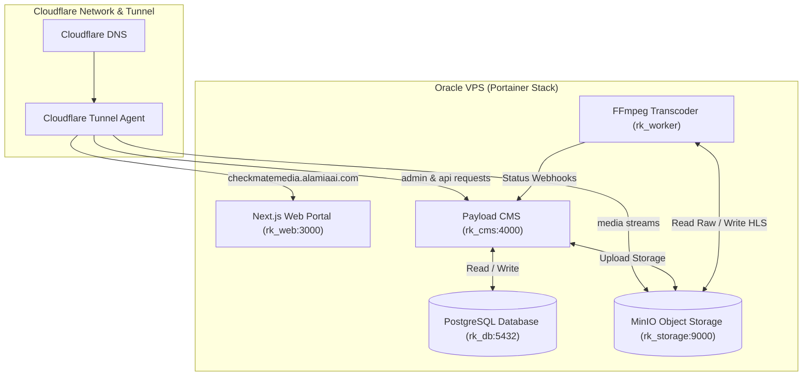

# System Architecture — Alamia OTT / RK Portal

## 1. Executive Intent & Deployment Architecture
**Alamia OTT / RK Portal** is a production-grade **hybrid News + Video (OTT) platform** inspired by modern digital media houses such as the BBC, Al Jazeera, DW, and TRT World.

### Production Infrastructure Model
* **Hosting Platform**: Oracle VPS running Docker + Portainer.
* **Ingress & Domain Gateway**: Cloudflare Tunnel routing traffic directly to container ports (e.g. `http://rk_web:3000` & `http://rk_cms:4000`). No internal Caddy/Nginx reverse proxy container needed.
* **Deployment Workflow**: Single-click Portainer Stack deployment directly pulling from GitHub (`docker-compose.yml`).

---

## 2. High-Level System Architecture Diagram

---

## 3. Container Topology

| Service Name | Container Name | Port | Cloudflare Tunnel Rule | Description |
| :--- | :--- | :--- | :--- | :--- |
| **`rk_web`** | `rk_web` | `3000` | `checkmatemedia.alamiaai.com` $\rightarrow$ `http://rk_web:3000` | Next.js App Router public website & Video.js player. |
| **`rk_cms`** | `rk_cms` | `4000` | `checkmatemedia.alamiaai.com/admin*` $\rightarrow$ `http://rk_cms:4000` | Payload CMS administrative backend & GraphQL/REST APIs. |
| **`rk_storage`** | `rk_storage` | `9000` | `checkmatemedia.alamiaai.com/media*` $\rightarrow$ `http://rk_storage:9000` | MinIO S3 object storage for raw uploads and HLS streams. |
| **`rk_db`** | `rk_db` | `5432` | Internal | PostgreSQL 16 database. |
| **`rk_worker`** | `rk_worker` | Internal | Internal | Background FFmpeg HLS transcoding worker. |
