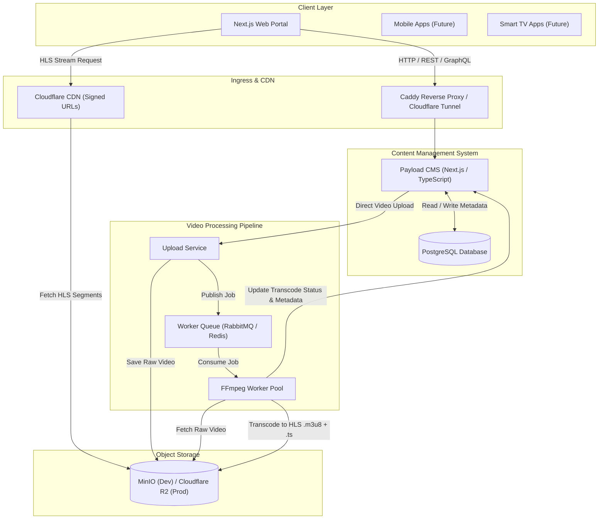

# System Architecture — Alamia OTT / RK Portal

## 1. Executive Intent & Architecture Model
**Alamia OTT / RK Portal** is a production-grade **hybrid News + Video (OTT) platform** inspired by modern digital media houses such as the BBC, Al Jazeera, DW, and TRT World.

Unlike pure video sharing platforms (YouTube/PeerTube) or personal media servers (Jellyfin), this system is **editorial-first** and **video-enhanced**:
* **Articles & News**: Written editorial pieces, categories, tags, authors, and opinion columns.
* **Video OTT**: On-demand video streaming via HLS, automated background transcoding, rich video metadata, and inline video embeds inside news articles.
* **Subscription & Monetization**: Tiered content access control (Free vs. Subscriber-only paywall simulation).
* **Multi-Client Readiness**: Single unified API powering Web, PWA, Mobile, and future Smart TV applications.

---

## 2. High-Level System Architecture Diagram

---

## 3. Core Component Specifications

### 3.1. Content Management System (CMS)
* **Technology**: Payload CMS (TypeScript / Next.js) backed by **PostgreSQL**.
* **Role**: Single administrative control plane for editorial staff and platform administrators.
* **Collections & Data Models**:
  * **Users & Roles**: Admin (full control), Editor (article/video publishing), Subscriber (paid consumer), Guest.
  * **Articles**: Rich text content, title, slug, excerpt, author, category, tags, publication status (Draft/Published), embedded video references, visibility level (Free vs. Subscriber).
  * **Videos**: Title, slug, description, raw video path, HLS playlist URL, duration, resolution levels, thumbnail URL, publication status, visibility level.
  * **Categories & Tags**: Hierarchical taxonomy for news and video categorization.
  * **Homepage Layout**: Featured article slots, hero banner configuration, video showcase carousels.

### 3.2. Object Storage Infrastructure
* **Development**: MinIO (S3-compatible local object storage).
* **Production**: Cloudflare R2 / AWS S3.
* **Buckets**:
  * `raw-uploads/`: Temporary ingestion bucket for source video files.
  * `hls-media/`: Output directory containing `.m3u8` playlists, `.ts` video chunks, and generated thumbnails.
  * `media/`: Images, author avatars, article hero images.

### 3.3. Asynchronous Video Processing Pipeline
* **Upload Service**: Drag-and-drop file uploader with chunking and progress reporting.
* **Task Queue**: Asynchronous job queue (Celery/RabbitMQ or Redis/BullMQ).
* **FFmpeg Workers**:
  1. **Metadata Extraction**: Inspect resolution, bitrate, audio streams, and exact duration.
  2. **HLS Packaging**: Transcode input video into HLS standard format (`playlist.m3u8` with target segment duration of 4–6 seconds).
  3. **Thumbnail Generation**: Extract keyframes at 20%, 50%, and 80% marks for article preview and video poster images.
  4. **Status Webhook**: Notify Payload CMS upon job completion or failure.

### 3.4. Public Frontend & Video Player
* **Technology**: Next.js (App Router), Tailwind CSS.
* **Video Player**: Video.js / hls.js supporting adaptive stream playback.
* **Key Page Routes**:
  * `/`: Modern homepage featuring news grid, opinion pieces, video hero banner.
  * `/news`: News article directory with category filtering.
  * `/opinion`: Columnist and opinion piece listing.
  * `/videos`: On-demand video library.
  * `/article/[slug]`: Article reading page with rich text and embedded HLS video player.
  * `/video/[slug]`: Dedicated video viewing page with metadata and related recommendations.
  * `/login` & `/register`: Subscriber authentication workflow.
  * `/search`: Full-text content search.

### 3.5. Membership & Paywall Engine
* **Access Control Levels**:
  * `FREE`: Publicly available to all visitors without authentication.
  * `MEMBER_ONLY`: Requires active logged-in Subscriber session.
* **Paywall Enforcement Mechanism**:
  * Frontend middleware blocks protected routes or displays teaser snippets with subscription prompts.
  * API backend validates JWT bearer token before issuing signed Cloudflare R2 / MinIO URLs for premium HLS playlists.

---

## 4. Architectural Tradeoffs & Alternatives Evaluated

| Platform / Approach | Score | Architectural Fit & Verdict |
| :--- | :---: | :--- |
| **Payload CMS + Custom FFmpeg Pipeline** | **19/20** | **SELECTED**: Best-of-breed. Perfect split between editorial CMS strength and optimized video transcoding. |
| **MediaCMS** | 17/20 | Excellent video features, but completely lacks article publishing capabilities. Would require dual-CMS overhead. |
| **PeerTube** | 15/20 | Great OSS video streaming, but zero editorial support. Decentralized federation is unnecessary bloat for RK Platform. |
| **AVideo / ClipBucket** | <12/20 | Legacy PHP architectures, plugin dependency risks, higher maintenance overhead. |
| **Jellyfin** | Rejected | Built as a personal media server (movies/TV libraries), entirely wrong paradigm for an OTT news portal. |

---

## 5. System Invariants & Critical Rules
1. **Asynchronous Video Ingestion**: Raw video files MUST NEVER be served directly to end-users. All video streams MUST be processed into HLS chunks prior to public availability.
2. **Decoupled API Contract**: The Next.js frontend MUST communicate strictly through API contracts (REST / GraphQL) provided by Payload CMS and the media gateway.
3. **Single HLS Encoding Profile for MVP**: To keep Sprint 2 transcoding speed high and infrastructure cost low, the MVP uses a single optimized 720p/1080p HLS profile before multi-bitrate ladder scaling is added in Phase 2.
4. **Security Bounds**: Protected media segments must require valid JWT authorization or short-lived signed URLs.

---

## 6. Failure Modes & Resilience Strategies

| Failure Mode | Impact | Mitigation Strategy |
| :--- | :--- | :--- |
| **FFmpeg Transcode Crash** | Video stuck in "Processing" state | Worker automatic retries (max 3), timeout enforcement, dead-letter queue, CMS error state update. |
| **MinIO Storage Outage** | Video playback & upload failure | Healthcheck monitoring, local caching, fallback to static placeholders on client. |
| **Database Connection Exhaustion** | CMS & API slowdown | Connection pooling (pgBouncer), query optimization, read replicas in scale phase. |
| **Unauthorized Media Direct-Linking** | Paywall bypass | Short-lived signed URLs with Cloudflare token authorization and domain locking. |
